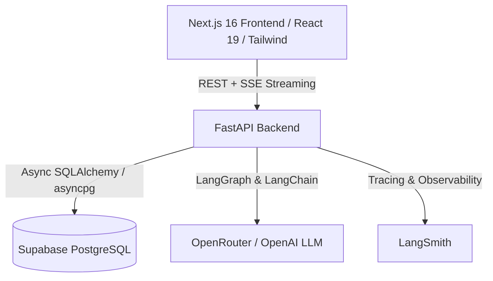

# ⚡ Micro CRM — AI-Powered Pipeline & Relationship Intelligence

A modern, high-performance Micro CRM featuring **AI-driven relationship briefs**, **automated draft message generation**, and an **autonomous LangGraph pipeline chat agent** that directly queries and logs interactions into a PostgreSQL (Supabase) database.

---

## 🌟 Key Features

- 📊 **Dynamic Pipeline Dashboard**: Live priority sorting (`Hot`, `Watch`, `Stable`, `Stale`) based on user-designated urgency and relationship velocity.
- 🤖 **LangGraph SQL Agent (`/api/chat`)**: Conversational AI agent equipped with read-only SQL safety guards and structured tools to query company records and log interactions.
- 💡 **AI Relationship Briefs & Draft Follow-ups (`/api/company/:id/insight` & `/api/company/:id/draft`)**: Real-time Server-Sent Events (SSE) streaming of deal summaries, blockers, and customized outreach emails.
- ⚡ **Lightning Fast Quick Log**: Non-chat modal to rapidly record meetings, calls, demos, and emails with urgency tracking.
- 🔭 **Full Observability with LangSmith**: Native tracing across all agent reasoning steps, SQL queries, and tool invocations.

---

## 🛠️ Architecture & Tech Stack



### **Frontend**
- **Framework**: [Next.js 16](https://nextjs.org/) (App Router, Turbopack)
- **UI Components**: React 19, Lucide Icons, Sonner Notifications, TailwindCSS
- **Communication**: REST API + Server-Sent Events (SSE) streaming

### **Backend**
- **Framework**: [FastAPI](https://fastapi.tiangolo.com/) (Python 3.13)
- **Database & ORM**: PostgreSQL ([Supabase](https://supabase.com/)), SQLAlchemy (Async Engine), `asyncpg`
- **AI & Agent Orchestration**: LangGraph, LangChain Core, `langchain-openai`
- **Dependency Management**: [`uv`](https://github.com/astral-sh/uv) package manager
- **Observability**: [LangSmith](https://smith.langchain.com/)

---

## 📁 Repository Structure

```
micro_crm/
├── frontend/                  # Next.js frontend application
│   ├── app/                   # App Router pages and layouts
│   ├── components/            # UI, Dashboard, QuickLog, and Chat components
│   ├── lib/                   # API client and streaming utilities
│   └── types/                 # TypeScript interfaces and domain models
├── backend/                   # FastAPI backend application
│   ├── config/                # Settings & Pydantic environment configuration
│   ├── data/                  # Seed dataset (crm_data.json)
│   ├── db/                    # SQLAlchemy async engine, ORM models, SQL schema, seed script
│   ├── routers/               # Endpoints: chat, priorities, companies, company, interactions
│   ├── schemas/               # Pydantic request & response schemas
│   └── services/              # AI services (agent_service, insight_service, data_service, tools)
├── docs/                      # Technical Requirements Document (TRD), datasets & evaluation criteria
├── vercel.json                # Monorepo multi-service deployment config
└── README.md
```

---

## 🚀 Quick Start Guide

### Prerequisites
- Node.js 20+ & `pnpm`
- Python 3.13+ & [`uv`](https://docs.astral.sh/uv/)
- Supabase PostgreSQL project
- OpenRouter or OpenAI API Key
- *(Optional)* LangSmith API key for tracing

---

### 1. Database Setup (Supabase)
1. In your Supabase SQL Editor, execute the schema from [`backend/db/schema.sql`](backend/db/schema.sql).
2. Copy your Supabase PostgreSQL connection string.

---

### 2. Backend Setup

1. Navigate to the backend directory:
   ```bash
   cd backend
   ```

2. Create `.env` from `.env.example`:
   ```bash
   cp .env.example .env
   ```

3. Fill in your credentials:
   ```env
   DATABASE_URL=postgresql+asyncpg://postgres.<ref>:<password>@<host>:5432/postgres
   OPENROUTER_API_KEY=sk-or-v1-...
   LLM_MODEL=openai/gpt-4o-mini
   
   # Optional LangSmith Tracing
   LANGCHAIN_TRACING_V2=true
   LANGCHAIN_ENDPOINT="https://api.smith.langchain.com"
   LANGCHAIN_API_KEY=lsv2_pt_...
   LANGCHAIN_PROJECT="micro-crm"
   ```

4. Install dependencies:
   ```bash
   uv sync
   ```

5. Seed the database with sample companies, contacts, and interactions:
   ```bash
   uv run python -m db.seed
   ```

6. Start the backend server:
   ```bash
   uv run uvicorn main:app --reload --port 8000
   ```

---

### 3. Frontend Setup

1. Open a new terminal and navigate to the frontend:
   ```bash
   cd frontend
   ```

2. Create `.env.local`:
   ```bash
   echo "NEXT_PUBLIC_API_URL=http://localhost:8000" > .env.local
   ```

3. Install dependencies:
   ```bash
   pnpm install
   ```

4. Start the development server:
   ```bash
   pnpm dev
   ```

5. Open [http://localhost:3000](http://localhost:3000) in your browser.

---

## 🧪 Testing & Verification

- **Backend Health Check**:
  ```bash
  curl http://localhost:8000/health
  curl http://localhost:8000/health/db
  ```
- **Run Backend Tests**:
  ```bash
  cd backend
  uv run pytest
  ```
- **Test Frontend Build**:
  ```bash
  cd frontend
  pnpm build
  ```

---

## 🌐 Deployment (Vercel)

This repository is pre-configured with `vercel.json` for multi-service deployment.

1. Push your repository to GitHub.
2. Import the project in [Vercel](https://vercel.com/new).
3. Set the Environment Variables (`DATABASE_URL`, `OPENROUTER_API_KEY`, `LLM_MODEL`, `LANGCHAIN_*`).
4. Click **Deploy**.

---

## 📜 License
MIT License. Feel free to use and adapt for your own workflows!
